# Latex_to_jpg
:tada:使用python将Latex公式转成jpg图片

依赖模块：**matplotlib，PIL，os**

**本地无需安装LaTeX软件**

**存在某些特殊公式无法输出的问题**

## 一些例子

```python
latex2jpg(r'J_\alpha(x) = \sum_{m=0}^\infty \frac{(-1)^m}{m! \Gamma (m + \alpha + 1)} {\left({ \frac{x}{2} }\right)}^{2m + \alpha}', 'latex1')
```

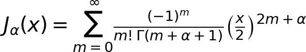

```python
latex2jpg(r'E=mc^2', 'latex2')
```

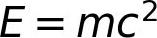

```python
latex2jpg(r'x^{y^z}=(1+{\rm e}^x)^{-2xy^w}', 'latex3')
```

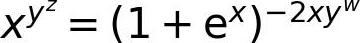

```python
latex2jpg(r'f(x,y,z) = 3y^2z \left( 3+\frac{7x+5}{1+y^2} \right)', 'latex4')
```

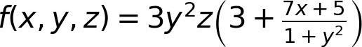

```python
latex2jpg(r'\left. \frac{{\rm d}u}{{\rm d}x} \right| _{x=0}', 'latex5')
```

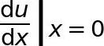

```python
latex2jpg(r'\frac{a-1}{b-1}', 'latex6')
```

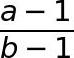

```python
latex2jpg(r'\sqrt{2}', 'latex7')
```

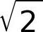

```python
latex2jpg(r'\vec{a} \cdot \vec{b}=0', 'latex8')
```

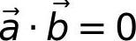

```python
latex2jpg(r'\overleftarrow{xy} \quad and \quad \overleftrightarrow{xy} \quad and \quad \overrightarrow{xy}', 'latex9')
```

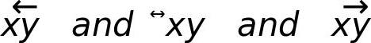

```python
latex2jpg(r'\int_0^1 {x^2} \,{\rm d}x', 'latex10')
```

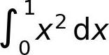

```python
latex2jpg(r'\lim_{n \to +\infty} \frac{1}{n(n+1)} \quad and \quad \lim_{x\leftarrow{n}} \frac{1}{n(n+1)}', 'latex11')
```

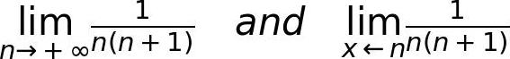

```python
latex2jpg(r'\sum_{i=1}^n \frac{1}{i^2} \quad and \quad \prod_{i=1}^n \frac{1}{i^2} \quad and \quad \bigcup_{i=1}^{2} R', 'latex12')
```

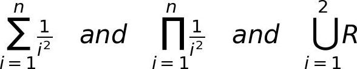

```python
latex2jpg(r'\alpha\gamma\epsilon\eta\iota\lambda\nu', 'latex13')
```

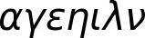
